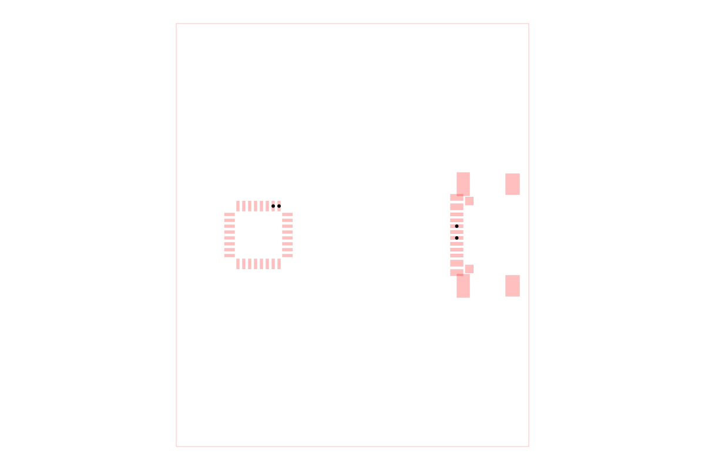

# dataset-srj12-bus-routing

A dataset of ten synthetic bus-routing problems for validating that an
autorouter can keep related signals organized through connector- and
component-dense layouts. Each sample includes a tscircuit source board, Simple
Route JSON, and a derived tiny-hypergraph representation in `dataset-dist/`.

## Example

The image below shows `sample001`. It is generated by constructing an
`AutoroutingPipelineSolver`, calling `.visualize()`, and converting that
graphics object with `graphics-debug`.



Run `bun run generate:readme-image` to regenerate the image.

## Browse and deploy

```sh
bun install
bun run cosmos
bun run build:site
```

The static Cosmos catalog is exported to `cosmos-export/`, which is the Vercel
output directory configured by `vercel.json`.
